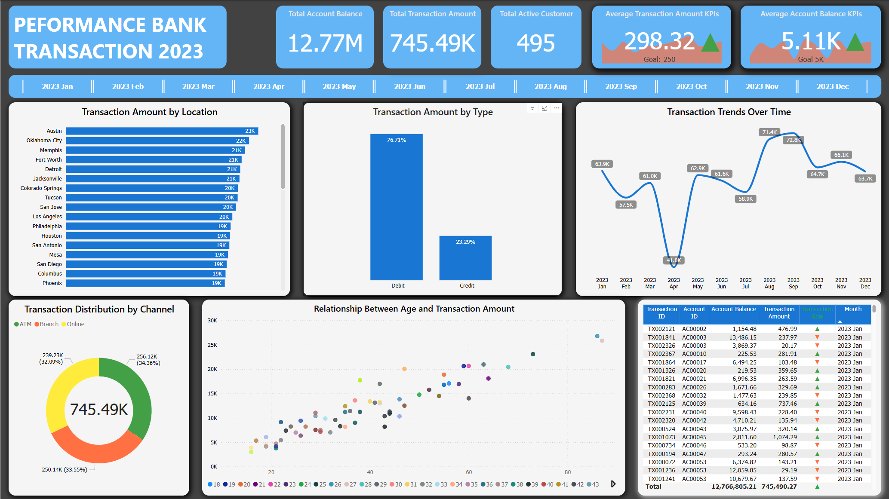
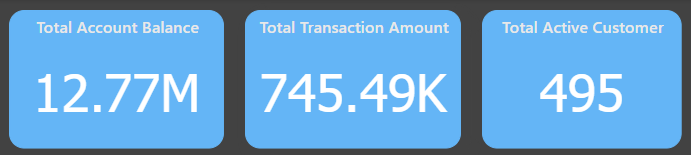
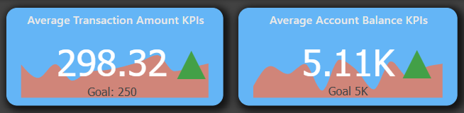
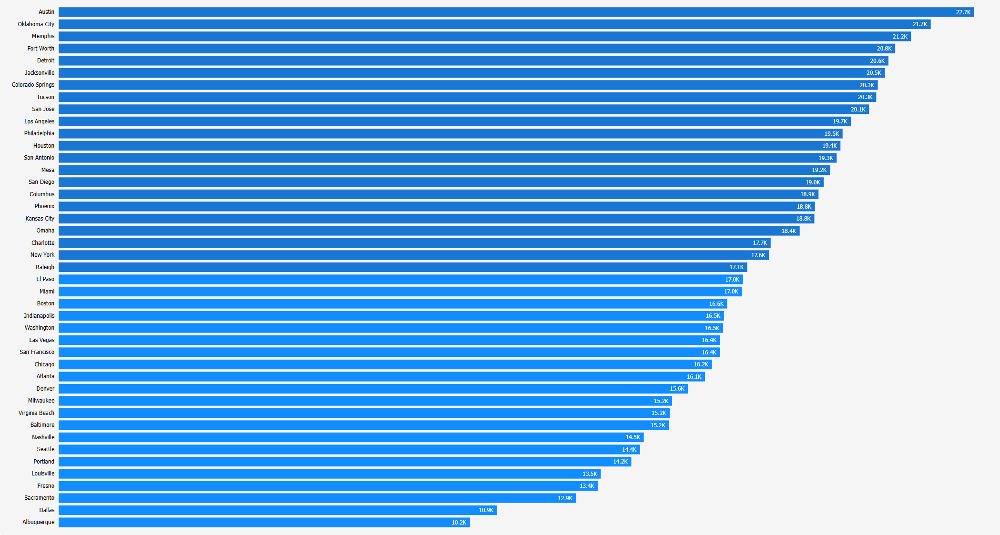
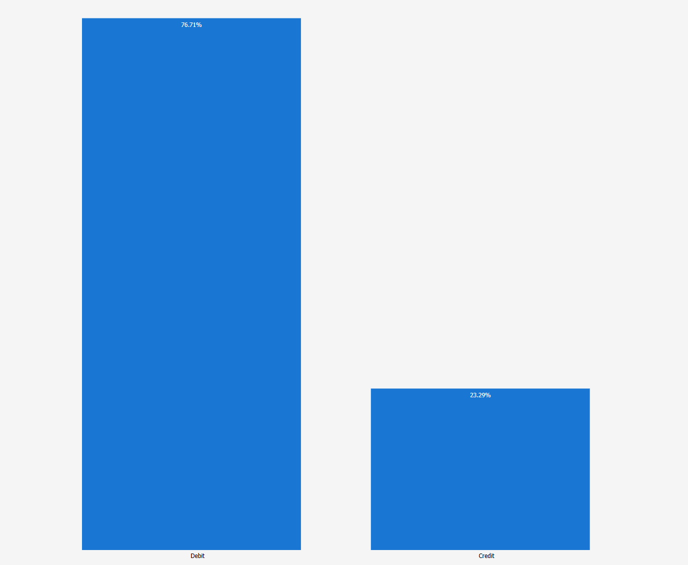
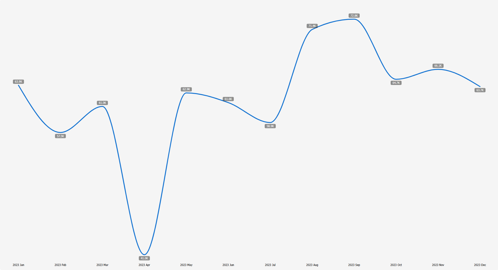
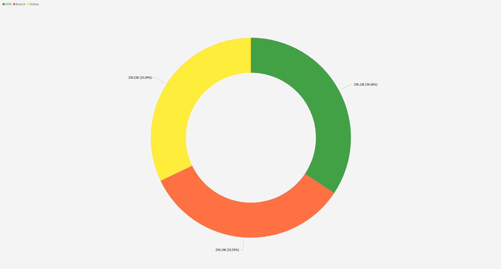

# Explanation

Source Dataset: https://www.kaggle.com/datasets/valakhorasani/bank-transaction-dataset-for-fraud-detection by [Vala Khorasani](https://www.kaggle.com/valakhorasani)

This dataset contains trancsaction in bank in **2023**. I performed data cleaning using **MySql** and **Excel**. The cleaning process included **removing duplicates, converting data types, filtering data, and exporting the cleaned data to CSV**. The processed data was then visualized in **Power BI** to extract valuable insights.

# Insight

### 1. Performance of Transactions in 2023:

- **Total Transaction Amount**: With a total of **745.49K** transactions, this indicates a high transaction volume for the company. This can be used to evaluate yearly growth and plan strategies to further increase transaction volume.
- **Total Account Balance**: With a balance of **12.77M**, the company holds a solid base of funds, which can be leveraged for liquidity strengthening and product development.
- **Total Active Customers**: There are **495 active customers** in 2023. This gives an overview of the number of customers actively transacting with the company, which shows the company’s market presence.

### 2. Key Performance Indicators (KPIs):

- **Average Account Balance**: At **5.11K**, slightly above the **5K** goal, this indicates that the average account balance remains stable and meets the target set by the company.
- **Average Transaction Amount**: With an average of **298.32**, surpassing the **250 goal**, the company has successfully achieved a higher transaction volume than anticipated, indicating the effectiveness of the strategies employed.

### 3. Transaction Amount by Location:

- **Top Locations by Transaction Volume**: **Austin**, with **23K** transactions, stands out as a key location. This indicates a highly active market, which can be targeted for further marketing and engagement strategies.
- **Cities with Growth Potential**: Cities such as **Oklahoma City, Memphis, and Fort Worth,** each with **22K** transactions, show high potential and can be explored further.

### 4. Transaction Type (Debit vs. Credit):

- **Debit Dominates**: With **76.71%** of transactions using **Debit**, this shows that customers prefer debit transactions. The company might consider offering more promotions or incentives to encourage more debit card usage.
- **Credit Transactions are Limited**: With only **23.29%** of transactions using **Credit**, there is an opportunity to focus on increasing the adoption of credit products, especially for customers who are not fully utilizing credit services.

### 5. Transaction Trends Over Time:

- **Significant Monthly Fluctuations**: The data shows substantial variation in transactions throughout the year. For example, **April** saw a sharp decline to only 41K transactions, while July and December had a significant increase (**71.4K** and **72.8K**, respectively). This could indicate seasonal factors or specific promotions that influenced transaction volume.
- **Positive Overall Trend**: Despite fluctuations, the data shows an **overall upward trend** in transactions across most months, indicating positive growth from month to month.

### 6. Transaction Distribution by Channel:

- **Age-Transaction Relationship**: The scatter chart showing the relationship between **customer age** and **transaction amount** reveals that transactions tend to increase with age. Older customers tend to have higher transaction amounts, which indicates that they may have greater purchasing power.
- **Marketing Strategy by Age**: This can be leveraged to design targeted marketing campaigns, offering products or services that are more tailored to the needs of younger or older customers.

## Strategic Recommendations:

1. **Market Expansion Based on Location**: Focus marketing efforts in cities with high transaction volumes, such as **Austin** and **Oklahoma City**, while exploring untapped potential in cities with lower transaction volumes.
2. **Increase Credit Product Adoption**: Given the high use of **Debit**, the company could enhance incentives or promotions related to **Credit** products to boost adoption.
3. **Strengthen Online Channel**: Focus more on the **Online** channel, which shows the largest transaction contribution, by introducing new features or promotions to attract more customers.
4. **Segment by Age**: Consider tailoring products or services based on customer age groups, with special offers for younger or older demographics who tend to have lower or higher transaction volumes.
5. **Improve Performance in Declining Transaction Months**: Address months like **April**, which saw a sharp decline in transactions. Perform further analysis to understand the causes and plan targeted promotions or strategies to improve transactions in months with lower performance.

# Conclusion

The 2023 performance dashboard highlights strong transaction volumes and solid account balances, with opportunities for further growth:

1. **Focus on High-Volume Locations**: Cities like Austin and Oklahoma City should be prioritized for marketing and expansion.
2. **Increase Credit Product Adoption**: With debit transactions dominating, there is potential to boost credit usage.
3. **Leverage Online Transactions**: The online channel shows the highest transaction volume, warranting increased investment in online features and promotions.
4. **Target Age Groups**: Older customers tend to transact more, so tailoring services by age can drive engagement.
5. **Address Seasonal Declines**: Analyze and improve performance in months like April, where transactions were lower.
