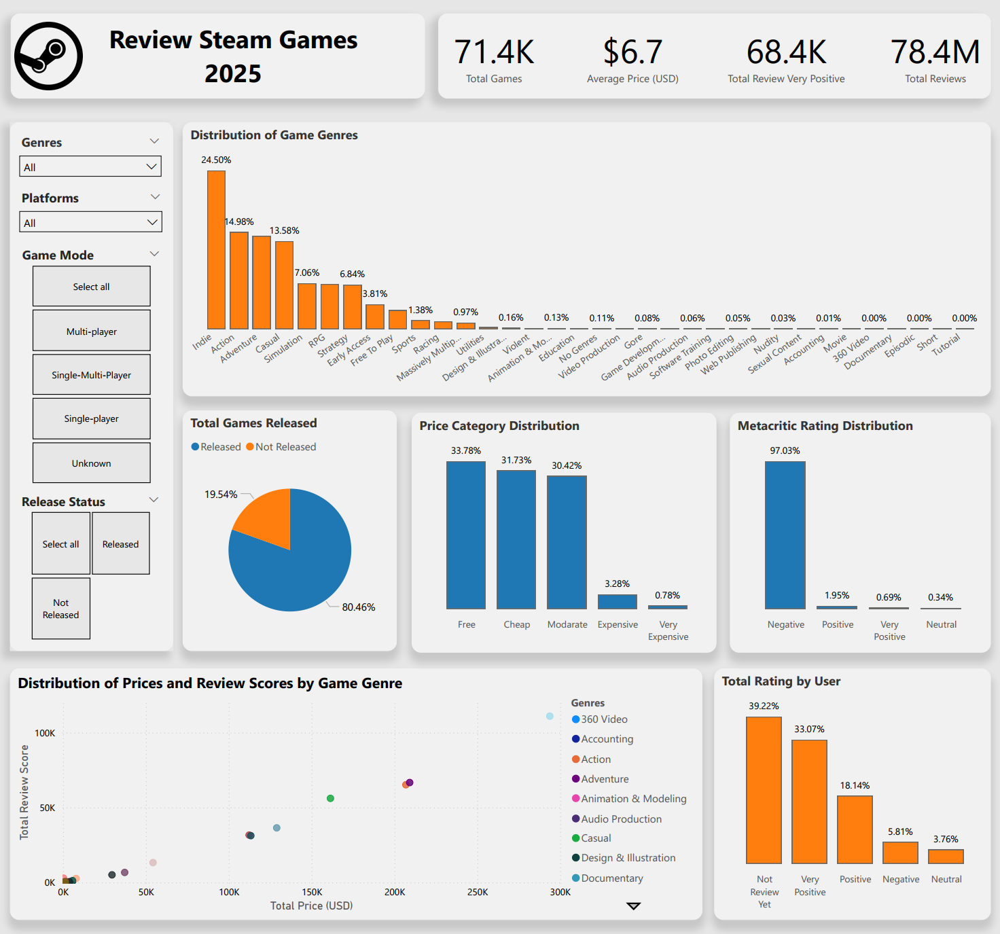

# Explanation

Source Dataset: https://www.kaggle.com/datasets/srgiomanhes/steam-games-dataset-2025 by [Sérgio Manhães](https://www.kaggle.com/srgiomanhes)

This dataset contains game reviews from the Steam platform in **January 2025**. I performed data cleaning using **Python** and frameworks such as **Pandas, NumPy, and AST**. The cleaning process included **removing duplicates, dropping irrelevant columns, converting data types, categorizing specific columns, filling missing (NaN) values, and exporting the cleaned data to CSV**. The processed data was then visualized in **Power BI** to extract valuable insights.

# Insight

### 1. Indie Genre Dominance

The **Indie genre dominates the market**, accounting for **24.5% of total released games**, followed by **Action (14.98%) and Adventure (13.58%)**. This trend highlights the **growing influence of independent developers in the gaming industry on Steam**.

### 2. Majority of Games Have Been Released

Out of **71.4K total games, 80.46% have been released**, while **19.54% are still in development**. This suggests that **most game projects on Steam successfully reach their final release stage** and become available to players.

### 3. Most Games Are Free or Cheap

The majority of games fall into the **Free (33.78%), Cheap (31.73%)**, and **Moderate (30.42%)** price categories. Only a small percentage are classified as **Expensive (3.28%) or Very Expensive (0.78%)**, indicating that **affordable games dominate Steam’s marketplace**.

### 4. **Most Metacritic Reviews Are Negative**

**97.03% of games have received negative ratings on Metacritic**, with only **1.95% receiving positive reviews**. This suggests that **many games fail to meet player expectations or are perceived as low-quality**.

### 5. **User Reviews Are Mostly From Non-Reviewers**

**39.22% of users have not left a review, while 33.07% gave a Very Positive rating**. Despite **negative Metacritic reviews, user reviews show a more diverse perspective**, indicating that **Metacritic scores do not always reflect the actual player experience**.

### 6. **Scatter Plot Analysis**

**Expensive games (>100K USD) are not necessarily popular**, as they tend to receive fewer reviews than lower-priced games. Genres like **Indie, Action, and Adventure** attract **more reviews despite their lower prices (~0K - 100K USD), indicating higher player interest**. Meanwhile, niche genres such as **Simulation and Game Development** maintain **higher price points yet still receive substantial reviews, indicating a premium market segment**. **Free-to-Play games generate the highest number of reviews**, likely due to **their accessibility**.

# Conclusion

The **Steam gaming market in January 2025 is dominated by affordable Indie games. While most games have been released, many receive negative reviews on Metacritic**. However, **user reviews present a more balanced perspective**, with **a significant number of positive ratings**. Additionally, **game pricing does not always correlate with popularity**, as **cheaper or Free-to-Play games tend to attract more reviews than expensive ones**.
